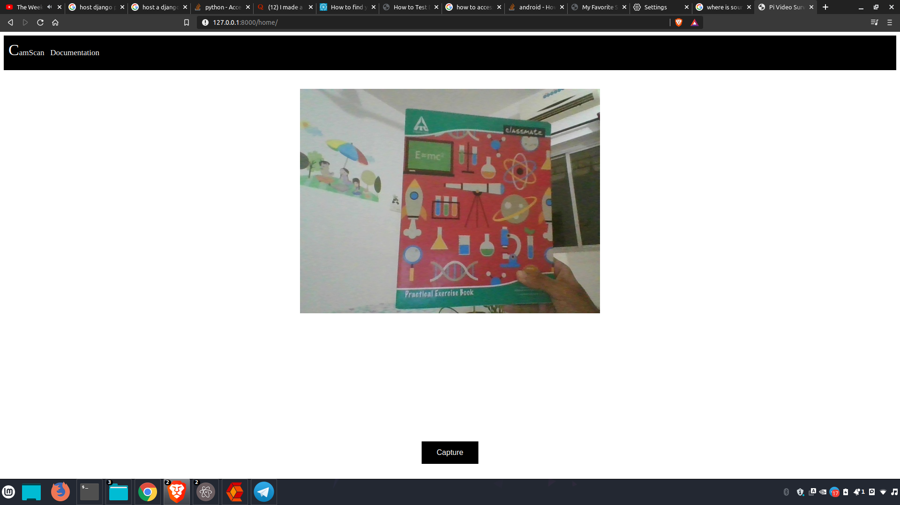
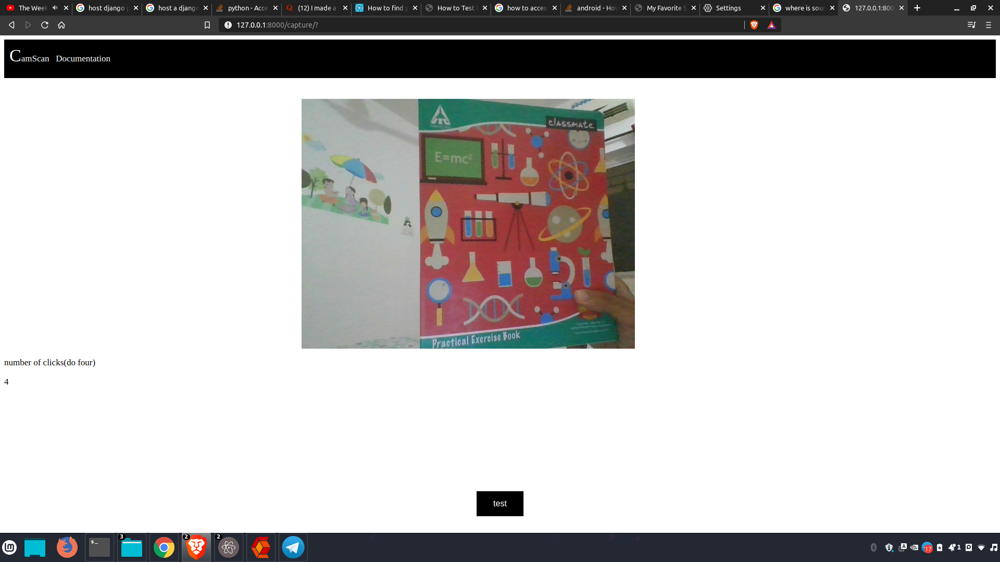
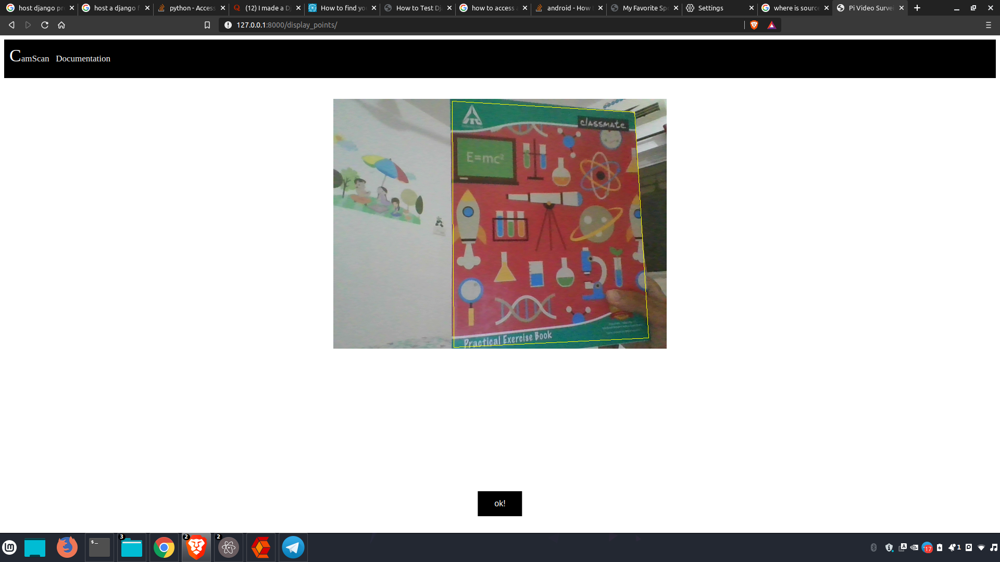
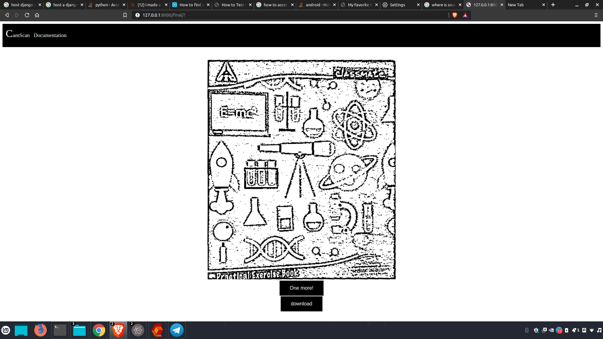
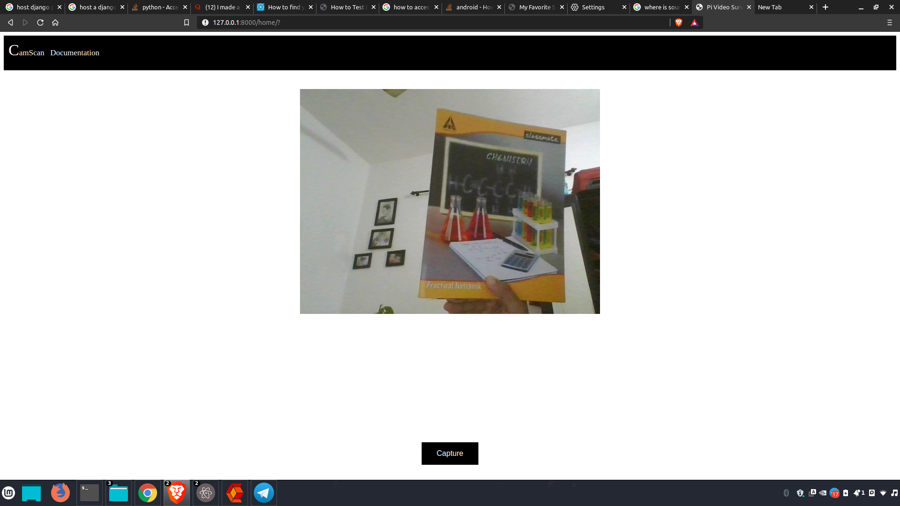
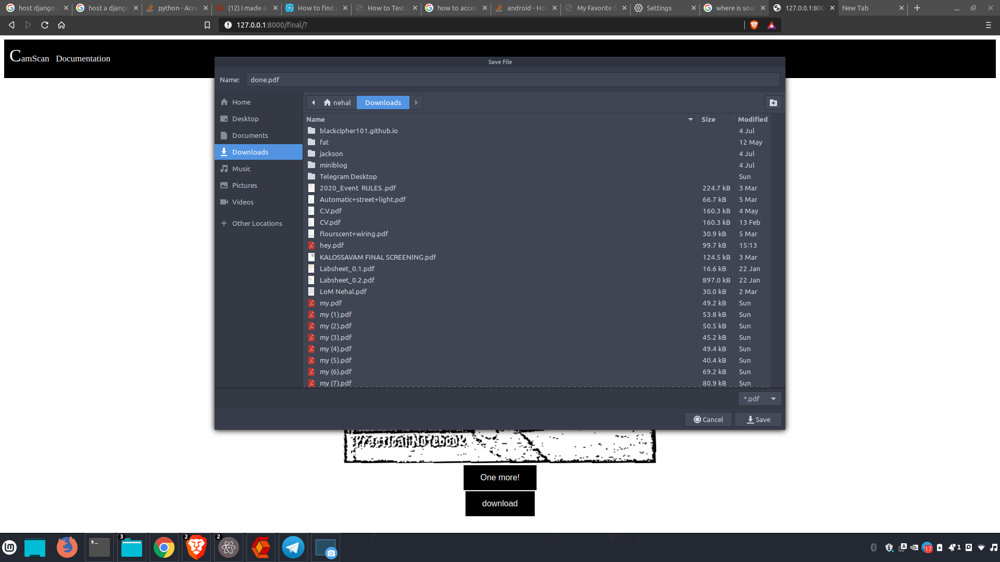
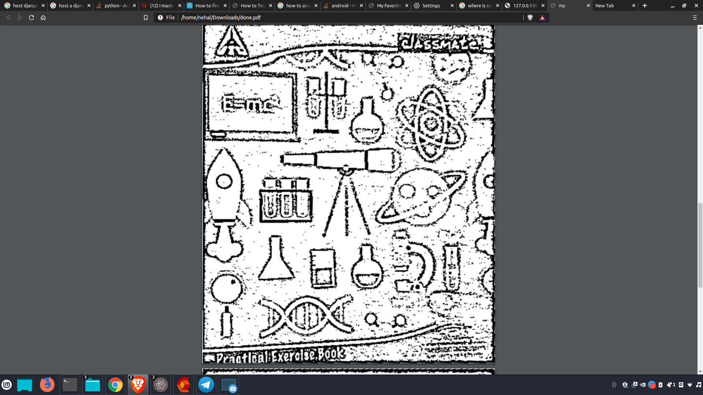

## CamScan
This a lightweight tool for making documents on the fly :running: from camera images.
So this uses OpenCV and Django in tandom also pillow is used to make the pdf

### Features
1)To PDF<br>
2)Image Sharpen :mag_right:<br>
3)Document like look :page_with_curl:<br>
4)Multipagepdf<br>
5)Cropping :scissors:<br>
6)Test your Crop :corn:<br>



Capture image from camera



To give the corners for the crop



This gives you the ability to test your crop and which area is selected.



This is the Final result of the image.



You can add more images if you like to the document.



This is the Downloading of your PDF...... Wait




:boom: Voila ! you have your PDF ready


### To bulid

#### Dependencies
```
pip install Django
pip install opencv-python
pip install pillow
pip install mime
```

#### Project

Clone the repo
```
git clone "git-URL"
```

To run server
Go to the directory contianting manage.py
```
python manage.py migrate
python manage.py makemigrtation
python manage.py runserver
```

Now visit the URL given in the terminal most probably 127.0.0.1:8000/home

### Contribution
Feel free to report issues and send PRs :innocent:
